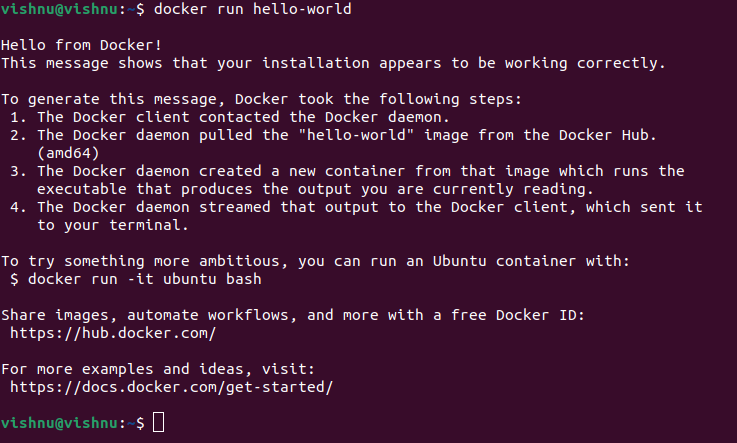

# Task 2: EDA Tool Installation and Environment Setup

This document provides a record of the successful installation and setup of the necessary Electronic Design Automation (EDA) tools for the RISC-V SoC Tapeout Program. The environment was configured according to the provided guidelines.

---

## 💻 System Configuration

The installation was performed on a **dual-boot system** with the following hardware and software specifications:

* **Operating System**: Ubuntu 22.04.5 LTS
* **Processor (CPU)**: 12th Gen Intel(R) Core(TM) i7-12650H (16 Cores)
* **RAM**: 15Gi
* **Root Partition Size**: 145G

---

## ✅ Prerequisite Dependencies Verification

[cite_start]Before installing the main EDA tools, the build environment was confirmed by checking the versions of essential prerequisite packages like Git, Docker, Python, and Make.

*Screenshot showing the output of the dependency version checks:*

---

## 🛠️ Tool Installation Verification

The following open-source EDA tools were installed as per the instructions. A screenshot is attached for each tool to verify its successful installation.

### 1. Yosys

**Yosys** is a framework for Verilog RTL synthesis, used to convert our hardware description into a gate-level netlist.

*Screenshot of Yosys version or successful 'make install' output:*

### 2. Icarus Verilog (iverilog)

**Icarus Verilog** is a Verilog compiler and simulator. It acts as the engine that runs the Verilog code and generates the simulation data.

*Screenshot showing the version of `iverilog`:*

### 3. GTKWave

**GTKWave** is a waveform viewer used to graphically display and analyze the simulation data files (like `.vcd` files) produced by `iverilog`.

*Screenshot showing the GTKWave application open or its version:*

### 4. Magic

**Magic** is a venerable VLSI layout tool used for designing and editing the physical layout of integrated circuits.

*Screenshot of the Magic tool running or version check:*

### 5. ngspice

**ngspice** is an open-source mixed-signal circuit simulator used for analog circuit verification.

*Screenshot showing ngspice running or its version number:*

### 6. OpenLane

**OpenLane** is an automated RTL to GDSII flow that integrates many of the tools listed above to create a complete, automated chip design pipeline. Its installation requires **Docker**.

*Screenshot of the successful Docker `hello-world` test:*

---

## ✅ OpenLane and PDK Setup

The final step in the setup was to build the OpenLane environment and install the required Process Design Kits (PDKs). [cite_start]This was accomplished by running the `make` and `make test` commands inside the OpenLane directory. [cite: 80, 81]

*Screenshot of the final output of the `make test` command, showing that all tests passed successfully:*

With all tools installed and verified, the development environment is now fully prepared for the upcoming design tasks.